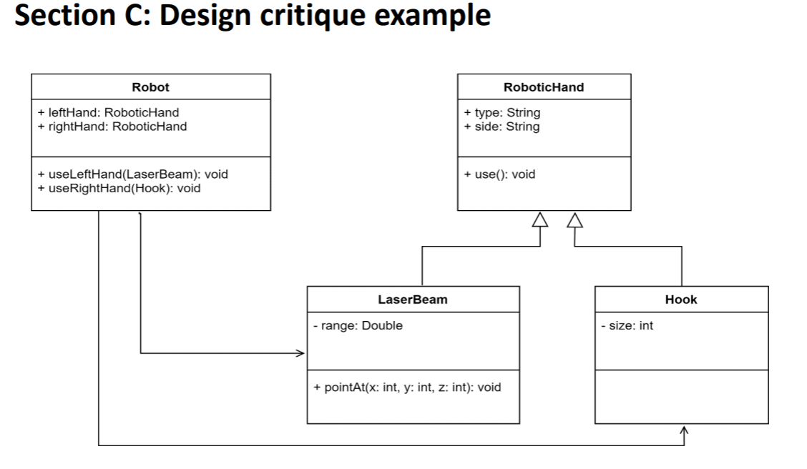
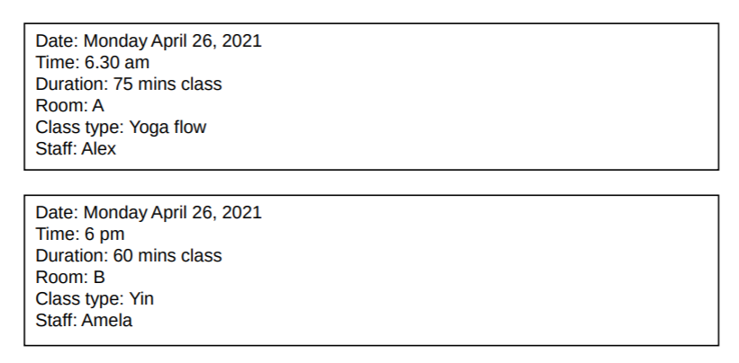
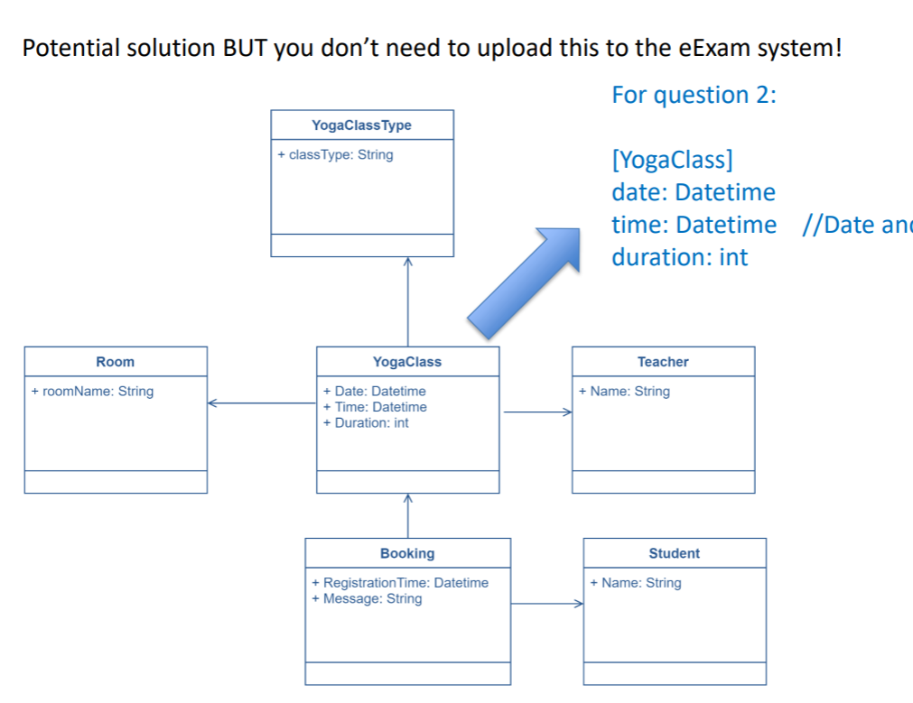

# FIT2099 Exam


<!-- markdown-toc start - Don't edit this section. Run M-x markdown-toc-refresh-toc -->
**Table of Contents**

- [FIT2099 Exam](#fit2099-exam)
    - [Code Revision Example](#code-revision-example)
        - [Circle](#circle)
        - [Triangle](#triangle)
    - [Code Critique Example](#code-critique-example)
        - [Solid principles violated](#solid-principles-violated)
    - [Design Critique Example](#design-critique-example)
        - [Issues](#issues)
    - [Design Example](#design-example)
        - [Question 1:](#question-1)
        - [Question 2:](#question-2)

<!-- markdown-toc end -->

## Code Revision Example
```java
public interface Shape {
  public void draw();
  public double getArea();
}
```

You have been asked to write the code to calculate the area of two shapes:
Circle and Triangle. Please, create two classes using the Shape interface and
following the next requirements:
• The area of a Circle is pi times the radius squared (hint: use Math.PI to get
the value of PI).
• The area of a Trinagle is the product of the height and width of the triangle
divided by 2.
• You don’t have to code the logic for drawing the shapes, you can simply print
a message using System.out.println("some text");

### Circle
```java

public Circle implements Shape() {
   
   private double radius;
    
    public Circle(radius) {
        this.radius;
    }

    @Override
    public void draw() {
        System.out.println("Draw the circle");
    }
    
    @Override
    public double getArea() {
        return radius^2*Math.PI;
    }
    
}

```

### Triangle
```java

public Triangle implements Shape() {
   
    private double width;
    private double height;

   
    public Triangle(width, height) {
        this.width = width;
        this.height = height;
    }

    @Override
    public void draw() {
        System.out.println("Draw the triangle");
    }
        
    @Override
    public double getArea() {
        return 0.5*width*height;
    }
    
}

```


## Code Critique Example
```java
public abstract class Bird{
  public void fly();
}
public class Cockatoo extends Bird{…}
public class Emu extends Bird{…}
```

### Solid principles violated
Liskov substitution principle is violated because when you extend from Bird, the child class is expected to do everything the Bird abstract class can do. However even emu cannot because so it cannot do what its parent class can do. So liskov substitution principle is violate. 

Also interface segregation principle is violated as well because an interface designed for birds that can fly can be created to segregate birds that can and cannot fly.

Also since the bird can is not open to be extended to all types of birds. This is violated as well. In order to create an emu class, the bird class needs to be modified.

#### Solution
-------------------------------------------------------------------------------

Remove fly() method from Bird abstract class.
Create an interface called CanFly() that includes the fly method.
Cockatoo class extends from Bird and implements canFly. Interface segregation.
Emu only extends from Bird. Liskov Substitution principle Satisfied.

## Design Critique Example

You are creating a text-based game based on robots with the following characteristics:
• The hands of the robots can be interchangeable with tools and “weapons”.
• There are currently two types of RoboticHands: a laser beam and a hook. A laser
beam has a range and can be pointed to certain 3D coordinates. The hook is just a
hook of varied sizes.
Some colleagues have proposed a design for the Robotic Hand system. They have
produced the following class diagram:



1) There is a new requirement to create 5 new types of hands. You realise that the
current design may not be adequate. Your task is to find the flaws in this design
(if any). What are the main problems with this design? Briefly explain in no
more of 8 lines. (3 marks)

### Issues
* The robot depends directly on the child RoboticHand methods. There should be interfaces that the robot can refer to, to access the method within the individual hand classes. Dependency inversion principle.

* Override use methods inside hand. Remove the use methods in Robot since they most likely would only serve as delegates to the use method in the RoboticHand. At least, they should suggest to remove passing the hand
subclasses as parameters.

* Not enough methods inside Robot to actually use the RoboticHands. There are not dependency injector for injecting or changing new hands. Recommend create getters and setters. Also it is recommended to make all attributes private.


## Design Example
You have been assigned to design a booking system for a small yoga studio with two rooms.
The studio has 2 rooms and classes can be run in any of them by different yoga teachers.
When students want to join a class they have to login in through the web system. They would be able to look at a list of yoga classes in this way:




### Question 1: 
Are the classes identified in the UML draft enough to model the booking system? (YES/NO), if not, what extra classes are needed and why? Please, write Yes or Not. If not, list the missing class(es) and in one line explain why this is needed (1 mark)

The classes are not enough because there a new class responsible for managing classes, registration time and also messages for the classes should be created. 

Report class should be created and teacher should be depend on report. The report stores and handles all the classes ran by the teacher and has a method that generates a report.

### Question 2: 
What attributes do need to be added to each class? Please, use the follow notation: 

[Room]
roomName: String
[Teacher]
attributeName: type
anotherAttributeName: type
[AnotherClass]

[YogaClass]
Room: Room
Teacher: Teacher

[Student]
Bookings: Booking Manager

#### Solution
-------------------------------------------------------------------------------


Question 1:
2 Marks: NO, a class called Booking is needed. They can use other similar names such as
registry or transaction. The justification should be helpful. If they add some extra classes
it is ok, just ignore.
If they suggest to have a subclasses for the different YogaClass types, give them 1 mark.
This is not really needed based on the requirements.
1 Mark: If they say NO and provide a class name without any justification or with some
very odd justification.
0 Mark: If they say Yes. Or if they say No and don’t provide any class nor clear
justification

Question 2:
3 marks: If the student justifies their rationale to include a new class called Booking or something
like that. The ideal solution is pasted below. This should be central to have 3 marks.
If they added inheritance and their rationale is convincing (for example, to support further
extensions of the system) it is ok. They can still have 3 marks.
If they suggest to merge classes (for example, YogaClassType) and give some rationale it would be
great.
They should mention at least one design principle, either the SRP, something around connascence,
or some other simple design principle. If the student does not explicitly mention a design principle
but effectively describe the design it is ok to stay in 3 marks.
2 marks: If their rationale is brief but at least contains an explanation for the need of a Booking
class and those relationships associated to it. They do not explicitly mention any design principle.
1 mark: If there is some attempt to describe the rationale but they missed the booking class or to
justify it.
0 mark: If the rationale is really hard to follow or not attempted.
