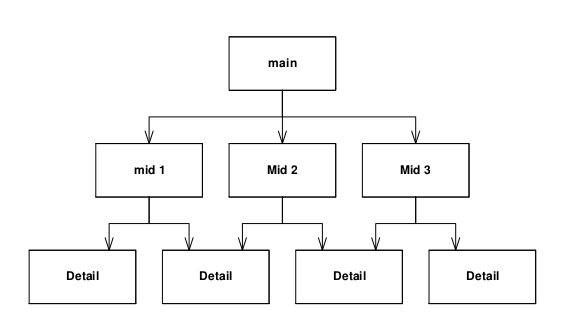

# SOLID

<!-- markdown-toc start - Don't edit this section. Run M-x markdown-toc-refresh-toc -->
**Table of Contents**

- [SOLID](#solid)
    - [Single requirement principles](#single-requirement-principles)
        - [Benefits of SRP](#benefits-of-srp)
        - [Violations of Single-requirement principles](#violations-of-single-requirement-principles)
            - [Overapplying SRO](#overapplying-sro)
    - [Open-close principle](#open-close-principle)
        - [Dynamic polymorphism](#dynamic-polymorphism)
        - [Static polymorphism](#static-polymorphism)
        - [Open for extension](#open-for-extension)
        - [Closed for modification](#closed-for-modification)
        - [Benefits of Open-Closed principle](#benefits-of-open-closed-principle)
        - [OCP in java?](#ocp-in-java)
    - [Liskov Substitution principle](#liskov-substitution-principle)
        - [The Circle/Ellipse Dilemma.](#the-circleellipse-dilemma)
        - [What does Liskov substitution principle means?](#what-does-liskov-substitution-principle-means)
        - [How is the LSP broken?](#how-is-the-lsp-broken)
        - [Repercussions of violating LSP:](#repercussions-of-violating-lsp)
            - [Sometimes OCP must be violated to fix LSP:](#sometimes-ocp-must-be-violated-to-fix-lsp)
    - [Interface segregation principle](#interface-segregation-principle)
    - [Dependency inversion principle](#dependency-inversion-principle)
        - [Why follow DIP?](#why-follow-dip)
            - [Mitigation forces: some classes are not volatile and may be depended on.](#mitigation-forces-some-classes-are-not-volatile-and-may-be-depended-on)
            - [Object creation: Abstract factory](#object-creation-abstract-factory)

<!-- markdown-toc end -->


## Single requirement principles

> A class should have one, and only one reason to change. <br />
> -- Robert C. Martin

* Each class should not take on extra responsibilities.
* Ideally it should contain all functionality need to support responsibilities.

### Benefits of SRP
* Code within classes are cohesive.
    * No excess feature getting in the way of change in responsibilities in the code.
    * This means that your system easier to **maintain and extend**.

### Violations of Single-requirement principles
***Example:*** God classes (breaching single requirement principles)

* Classes that try to do too much
  * e.g. one big class has all the methods
  * other classes just contain data

It is not easy to make changes in a big file! Can also occur when you’re bridging between object oriented and non-object oriented components of a system.

God classes have lots of reasons to change, so are hard to maintain.


#### Overapplying SRO

> Gather together the things that change for the same reasons. Separate those things that change for different reasons. <br/ >
> -- Robert C. Martin

* Classes can become too small
    * this will overcomplicate your design. Just make sure the classes are single responsible is enough.

```java 
public class Employee {
public string Name { get; set; }
public string Address { get; set; }
...
public void ComputePay() { ... } # SHOULD BE UNDER THE RESPONSIBILITY OF FINANCE
public void ReportHours() { ...} # SHOULD BE UNDER THE RESPONSIBILITY OF OPERATIONAL PEOPLE.
}
```

## Open-close principle
> Software entities (classes, modules, functions, etc.) should be open for extension, but closed for modification. <br />
> -- Robert C. Martin

By conforming with OCP, we can create modules that are extensible without being changed. We can add new features to existing code, without changing the existing code and by only adding new code.

Changes propagating to existing working code can introduce bugs.

### Dynamic polymorphism

* Often violates polymorphism.
* Often switches or if...else... statements are used to adapt new types. So methods must change whenever a new type/object is introduced.
* Each new object must be recompiled every time a new kind of modem is added.


```C
struct Modem {
  enum Type {
    hayes, courrier, ernie) type;
  };
  
  struct Hayes {
    Modem::Type type;
    // Hayes related stuff
  };
  
  struct Courrier {
    Modem::Type type;
    // Courrier related stuff
  };

  struct Ernie {
    Modem::Type type;
    // Ernie related stuff
  };

  void LogOn(Modem& m, string& pno, string& user, string& pw) {
      if (m.type == Modem::hayes)
      DialHayes((Hayes&)m, pno);
      else if (m.type == Modem::courrier)
      DialCourrier((Courrier&)m, pno);
      else if (m.type == Modem::ernie)
      DialErnie((Ernie&)m, pno)
      // ...you get the idea
    }
```

### Static polymorphism

Static polymorphism can be a solution where the **parent class can have a method that does not need to be changed when extended**. New modules can be created without modifications.

```C
class Modem {
public:
  virtual void Dial(const string& pno) = 0;
  virtual void Send(char) = 0;
  virtual char Recv() = 0;
  virtual void Hangup() = 0;
};

void LogOn(Modem& m, string& pno, string& user, string& pw) {
  m.Dial(pno);
  // you get the idea.
}
```

 

### Open for extension
* Able to add **new features**
* Able to add new methods easily and code modules support new functionality


 

### Closed for modification
We don’t want the way we currently use the code module to change. For example methods change name or signature could easily break existing client code
Changes to a module’s interface can be expensive which will need to go back and change client code to match it. This makes it harder to add features. So we want to be able to add features, but in a way that doesn’t change the way we use existing code.

### Benefits of Open-Closed principle

> We want to change what the modules do, without changing the source code of the modules.  <br />
> -- Robert C Martin

If your program is architected in a way that breaks the OCP, then **adding new features will often break old ones** Following OCP makes your code **easier to extend** and maintain.

**Abstraction** is key to the OCP.

### OCP in java?
* In Java, you can use interfaces to support the OCP
  * define them well and you won’t have to modify them
  * a class can implement an interface
  * can also add any extra methods it needs
  * can even implement other interfaces
  * we will come back to this idea in future lectures

## Liskov Substitution principle

> Derived classes should be substitutable for their base classes. That is, a user of a base class should continue to function properly if a derivative of that base class is passed to it. <br />
> -- Robert C Martin

 

* You should always be able to use an instance of a subclass when the code is expecting an instance of the base class. And the software shouldn’t break if you do so
* Derived from ***design by contract*** by Bertrand Meyer.


### The Circle/Ellipse Dilemma.

 

**Circle:** has 2 data elements: radius, centre.
**Ellipse:** has 3 data elements: radius, foci, centre.

| Ellipse                     | Circle |
| :-:                         | :-:    |
| Circumference(): double     |        |
| Area(): double              |        |
| SetFoci(a: Point, b: Point) | ❌     |
| setMajorAxis(double)        | ❌     |
| GetFocusA: Point            |        |
| GetFocusB: Point            |        |


But circle inherits from ellipse. And circle don't have foci... 

**WRONG (Design by contract violated):** We can make Circle behave properly by overriding its SetFoci method to ensure that both foci are kept at the same value.


```C 
void Circle::SetFoci(const Point& a, const Point& b)
{
  itsFocusA = a;
  itsFocusB = a;
}
```

> However, Circle and Ellipse do not live alone in a universe by themselves. They cohabit that universe with many other entities, and provide their public inter- faces to those entities. <br />
> --Robert C. Martin

Design by Contract:
```C
void f(Ellipse& e)
{
  Point a(-1,0);
  Point b(1,0);
  e.SetFoci(a,b);
  e.SetMajorAxis(3);
  assert(e.GetFocusA() == a);
  assert(e.GetFocusB() == b);
  assert(e.GetMajorAxis() == 3);
}
```
If we were to make the contract of Ellipse explicit, we would see a postcondition on the SetFoci that guaranteed that the input values got copied to the member variables, and that the major axis variable was left unchanged. Clearly Circle violates this guarantee because it ignores the second input variable of SetFoci.

Clearly Circle violates this guarantee because it ignores the second input variable of SetFoci.

Restating the LSP once again, this time in terms of the contracts, a derived class is substitutable for its base class if:
1. Its preconditions are no stronger than the base class method.
    * If the precondition fails, the results of the method are undefined, and the method ought not be called.
2. Its postconditions are no weaker than the base class method. Or, in other words, derived methods should expect no more and provide no less.
    * A method that fails its postcondition should not return.

### What does Liskov substitution principle means?
If **B is a subclass of A**, you should be able to put a B in anywhere the program expects an A

**A myA = new B()**; This is true even if A is an abstract class or interface

### How is the LSP broken?
LSP is broken if **a subclass can’t do everything its base class can do**. This is hard to do in Java, but not impossible:

```java
public void someMethod() {
    throw new MethodNotFoundError();
}
```

* In other languages such as C++, it’s easy to break LSP
    * C++ allows private inheritance
    * public methods in base class are private in the subclass


### Repercussions of violating LSP:
* Are difficult to detect until too late. E.g. in the Circle/Ellipse case, everything worked fine until some client came along and discovered that the **implicit contract has been violated**.
* Violations of LSP are latent violations of OCP.

#### Sometimes OCP must be violated to fix LSP: ####

**Ugly Fix:**
```C
void f(Ellipse& e)
{
  if (typeid(e) == typeid(Ellipse))
  {
    Point a(-1,0);
    Point b(1,0);
    e.SetFoci(a,b);
    e.SetMajorAxis(3);
    assert(e.GetFocusA() == a);
    assert(e.GetFocusB() == b);
    assert(e.GetMajorAxis() == 3);
  }
  else
    throw NotAnEllipse(e);
}
```

## Interface segregation principle

## Dependency inversion principle

Dependency Inversion is the strategy of **depending upon interfaces or abstract functions and classes**, rather than upon concrete functions and classes. The **majority of dependencies point towards abstractions**.

Moreover, the modules that contain detailed implementation are no longer depended upon, rather they depend themselves upon abstractions. **Thus the dependency upon them has been inverted**.

**Depending on implementation modules:**
 

**Depending on absctractions:**
 

### Why follow DIP?
When high level modules deal with the high level policies of the application. These policies generally care little about the details that implement them. Why then, must these high level modules directly depend upon those implementation modules?

The reason is simple, **concrete things change a lot, abstract things change much less frequently**. Moreover, abstractions are “hinge points”, they represent the places where the design can bend or be extended, without themselves being modified (OCP).

#### Mitigation forces: some classes are not volatile and may be depended on.

One motivation behind the DIP is to prevent you from depending upon volatile modules. The DIP makes the assumption that anything concrete is volatile.

However in some cases, modules are not at all volatile. String.h standard C library is very concrete, but is not at all volatile.

A dependency upon string.h could turn very ugly when the requirements for the project forced you to change to UNICODE characters. Non-volatility is not a replacement for the substitutability of an abstract interface.

#### Object creation: Abstract factory
One of the most common places that designs depend upon con- crete classes is when those designs create instances. By definition, you cannot create instances of abstract classes. Thus, to create an instance, you must depend upon a concrete class.

However, there is an elegant solution to this problem named ***ABSTRACT FACTORY***
