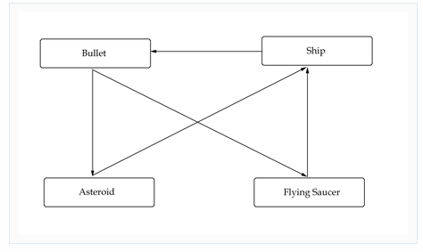
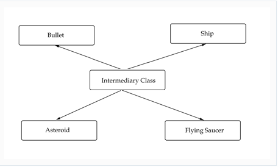

# Properties of connnascence

> "strive for low coupling and high cohesion". 

We should **strive for code that separates tasks and doesn't rely heavily on each other**.

## Cohesiveness

## Coupling
Coupling is the principle of "**separation of concerns**". 

This means that one object doesn't directly change or modify the state or behavior of another object.

### CSS and HTML
A good example of coupling is HTML and CSS. Before CSS, HTML was used for both markup and presentation. This created bloated code that was hard to change and difficult to maintain. 

With the advent of CSS, HTML became used just for markup, and CSS took over for presentation. 

This made the code fairly clean and easily changeable. The concerns of presentation and markup were separated.

### Why low coupling
Loose coupling lets the **code be more flexible, more changeable, and easier to work** with.

Objects that rely **on other objects and can modify the states of other objects** are said to be tightly coupled. 

Tight coupling creates situations where modifying the code of one object also requires changing the code of other objects (also known as a ripple effect). **Tightly coupled code is also harder to reuse** because it can't be separated.

### Solution

In Asteroids, a ship can fire a bullet, a bullet can hit an asteroid and a flying saucer, and an asteroid and a flying saucer can hit the ship. Our relations diagram then looks as follows:

### Tightly coupled 
 

### Less coupled with intermediary class
 

This relations diagram looks a lot better and creates a very loosely coupled system. In this system, if we were to add an object, such as a meteor, we could easily do so without having to change how the ship or bullet objects function - we'd just let our **intermediary class** take care of it all.

## Strength
The strength of a form of connascence is determined by the **ease with which that type of coupling can be refactored**. 

For example, connascence of name is a weak form of connascence because renaming entities across a codebase is usually reasonably trivial. However, connascence of meaning is considered a stronger form of connascence since semantic meaning is harder to find across an entire codebase.

Static connascences are considered to be weaker than dynamic connascences, since static connascences can be determined simply by examining the source code. Dynamic connascences require knowledge of run-time behavior, and thus are harder to reason about.

Strength and locality should be considered together. Stronger forms of connascence are often found within the same function, class, or module where their impact can be more easily observed.
