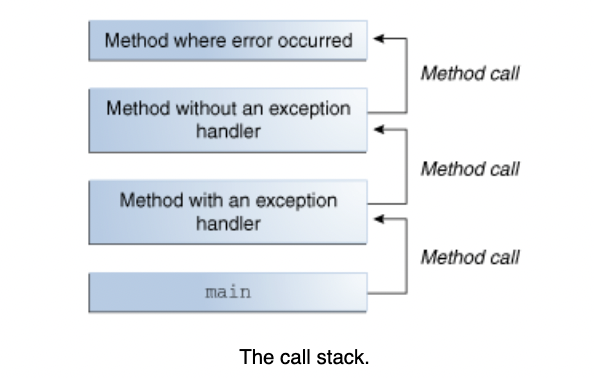
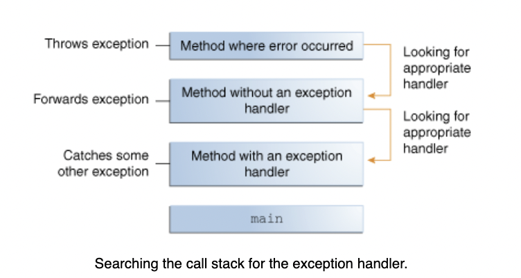

# Failfast in Java

##  What is an exception?

When an error occurs in a method, an exception object is created containing the information of the error. The methods then passes the exception object to the run-time system. This is called **throwing an exception**.

The runtime system then searches the call stack for a method that contains a block of code that can handle the exception. The block of code is called **exception handler**.

The **Exception handler** then **catches** the exception then the runtime system then terminates.

 


 


## How to throw an exception?

```java
throw someThrowableObject;
```


```java
public Object pop() {
    Object obj;

    if (size == 0) {
        throw new EmptyStackException();
    }

    obj = objectAt(size - 1);
    setObjectAt(size - 1, null);
    size--;
    return obj;
}
```


### Throwable classes

 

#### Error class

When a dynamic linking failure or other hard failure in the Java virtual machine occurs, the **virtual machine throws an Error**. Simple programs typically do not catch or throw Errors.

#### Exception class

An Exception indicates that a problem occurred, but it is not a serious system problem. 


Most programs you write will throw and catch Exceptions as opposed to Errors. Most programs throw and catch objects that derive from the Exception class.


**Example:** RuntimeException
One Exception subclass, RuntimeException, is reserved for exceptions that indicate incorrect use of an API. 

An example of a runtime exception is **NullPointerException**, which occurs when a method tries to access a member of an object through a null reference. The section Unchecked Exceptions — The Controversy discusses why most applications shouldn't throw runtime exceptions or subclass RuntimeException.

### The Catch or Specify Requirement

This means that code that might throw certain exceptions must be enclosed by either of the following:

* A try statement that catches the exception. The try must provide a handler for the exception, as described in Catching and Handling Exceptions.

* A method that specifies that it can throw the exception. The method must provide a throws clause that lists the exception, as described in Specifying the Exceptions Thrown by a Method. Code that fails to honor the Catch or Specify Requirement will not compile.

Not all exceptions are subject to the Catch or Specify Requirement. To understand why, we need to look at the three basic categories of exceptions, only one of which is subject to the Requirement.

#### Exception types

##### Checked exceptions #####
**Checked exceptions are subject to the Catch or Specify Requirement**. All exceptions are checked exceptions, except for those indicated by Error, RuntimeException, and their subclasses.

##### Errors #####
**Errors are not subject to the Catch or Specify Requirement**. Errors are those exceptions indicated by Error and its subclasses.

These are exceptional conditions that are **external to the application** where the applicate could not anticipate or recover from.

##### Runtime Exception #####
**Runtime exceptions are not subject to the Catch or Specify Requirement**. Runtime exceptions are those indicated by RuntimeException and its subclasses.

These are **exceptional conditions that are internal to the application**, and that the application usually cannot anticipate or recover from. These usually indicate programming bugs, such as logic errors or improper use of an API.
