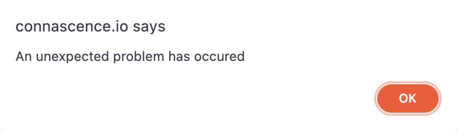

# Fail fast

## What is fail fast

When a system fails it immediately and visibly tells the programmer or user. Place your assertions so that the software fails earlier - close to the original problem.

Most languages have built-in assertions but do not contain useful messages. It is preferable to implement your own assertion class.

Good fail fast practices allows programmer to find bugs easily and get enough information.


## How to tell where to put assertions
One way do it is to look for comments. Comments often document assumptions about how a piece of code works or how it should be called.

When you write a comment think about how you can turn it into an assertions.

## Where to put assertions

### Common location for assertions

```java
public string readProperty (PropertyFile file, string key) {
  String result = file.readProperty(key);
  // assertion goes here return result;
  return result;
}
```

### What should an assertion look like?

A good assertions gives you just  the right amount of information.

```java
Assert.notNull(result, “can’t find [“ + key + “] property in config file [“ + file + “]”);
```

* Avoid writing assertions for problems inside method itself.

* Tests, particularly test-driven development, are a better way of ensuring the correctness of individual methods.

## What is a stack trace?

```java
System.NullReferenceException
    at Example.Main() in
        example.cs:line 22
        in example.cs: line 9
    at Example.Main() in
        example.cs:line 6
```


Sometimes stack trace leads to a deadend (typical of code design to fail slowly)

## How to make failure robust using Assertions
Do not ever disable assertions in the field when attempting to deploy the software to customers.

Usually when customers encounters errors, these errors are hardest to find. A well-placed assertion explaining the problem could save you days of effort.

### Global exception handler

**Global exception handler** can gracefully handle unexpected exceptions, such as assertions, and bring them to the developers’ attention. For example, a GUI-based program might display

#### Why global exception handler?
Implement a global error handler so your overall stability doesn’t suffer.

 

And provide an option to email tech support.

In global exception handling, prevent catch-all exceptions handlers in the rest of application. So the exceptions can be caught inside the global exception handler.

### How to ensure app keeps working after exception?
Also, when you use resources that have to be closed (such as files), be sure to use **finally blocks or using statements** (in C#) to clean them up. This way, if an exception occurs, the application will be returned to a fresh, working state

