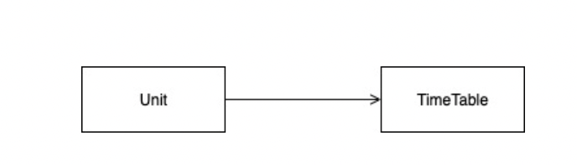
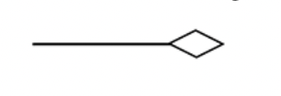
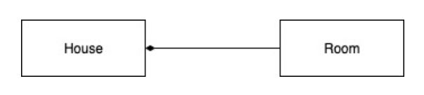
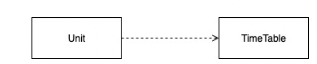
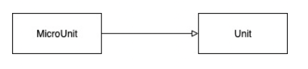

# UML diagrams

## Association

Class A and B relationship where class B is an attribute of class A.

 

```java
// A is Unit and B is timeTable
public class Unit {
    TimeTable timeTable;
    // the rest of class unit goes here
}
```

## Aggregation

Aggregation is a special type of Association relationship that could occur between classes A and B. 

In this type, **class B (the attribute) can exist independently**. We use the following arrow to describe the aggregation relationship.

 

```java
public class Unit {
   Student student;
}
```

## Composition

Composition is a special type of Association relationship that could occur between classes A and B. In this type, class B (the attribute) cannot exist independent of class A.

 

We use the following arrow to describe the Composition relationship.

```java
public class House {
    Room room;
    
}
```

## Dependency

 

Dependency is the most basic and the weakest type of relations between classes. 

There is a dependency between two classes if some changes to the definition of one class might result in modifications to another class. 

Dependency typically occurs when you use ***concrete class names** in your code. For example, when specifying types in method signatures, when instantiating objects via constructor calls, etc. You can make a dependency weaker if you make your code dependent on interfaces or abstract classes instead of concrete classes.

A relationship between class A and class B where class A needs an instance of class B to be sent as a parameter to one of its methods

We use the following arrow to describe the **Dependency relationship**.

```java
public class Unit {
    void updateStudentsTimeTable(TimeTable timeTable){
        //some code here
    }
    // the rest of class unit goes here
}
```

## Inheritance

A relationship between class A and class B where **class B extends class A**.

We use the following arrow to describe the Inheritance relationship.



```java
public class MicroUnit extends Unit{
    // the rest of class MicroUnit goes here
}
```


