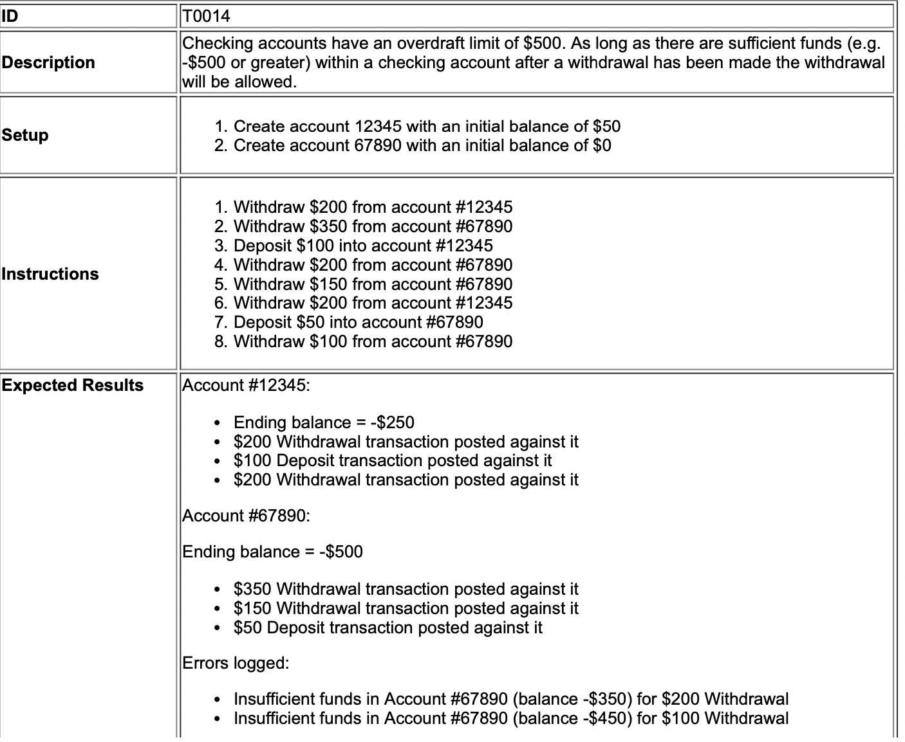
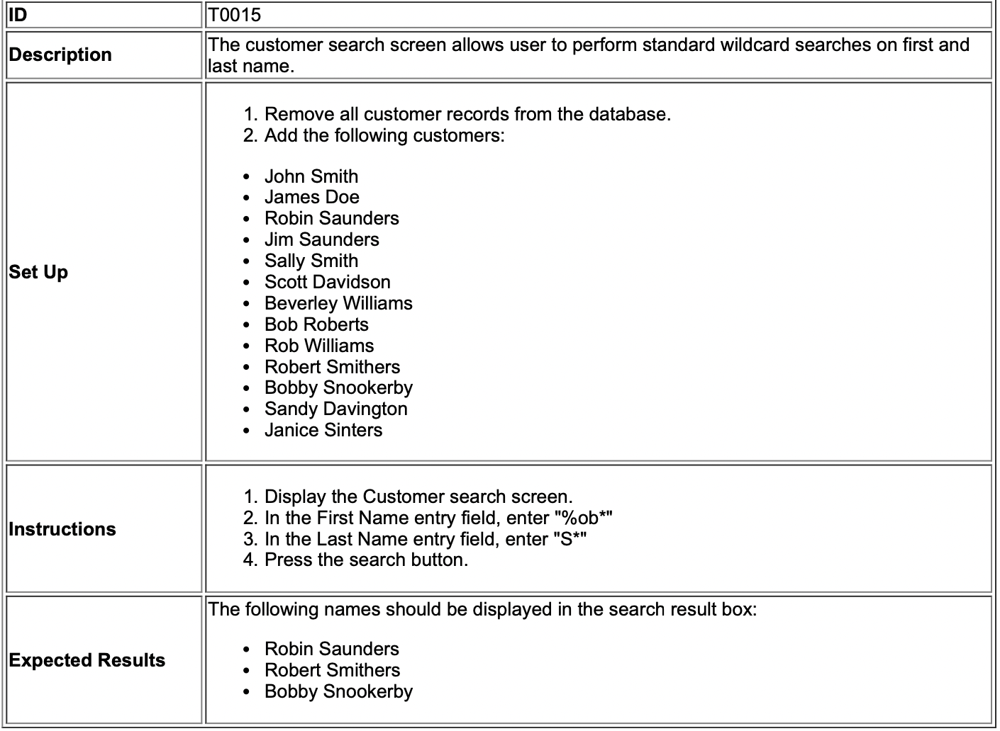

# Acceptance testing

<!-- markdown-toc start - Don't edit this section. Run M-x markdown-toc-refresh-toc -->
**Table of Contents**

- [Acceptance testing](#acceptance-testing)
    - [Acceptance testing can include but optionally:](#acceptance-testing-can-include-but-optionally)
    - [Why use acceptance testing?](#why-use-acceptance-testing)
    - [Example](#example)
    - [Measuring project progress](#measuring-project-progress)

<!-- markdown-toc end -->

A first class artefact involving black box testing to check if all the stakeholder features are satisfied. It consist of **executable specifications**

## Acceptance testing can include but optionally:

* Business rules
* features
* technical non-function requirements (NFRs) 
* detailed usage requirements

## Why use acceptance testing?

Can be used as both **detailed specification** tests to validate whether the app conforms with the stakeholder's requirements

Reduce traceability needs of the project because you only need to follow the requirement once as acceptance tests (**single source information**) instead of many times (with bother other requirements artefacts and as acceptance test.).

TODO does this mean if acceptance test then no user stories?

## Example

 

 

Is a first class artefact

## Measuring project progress
Project progress can be measure through **tested feature metric**. This is capture through having an acceptance test.
      

