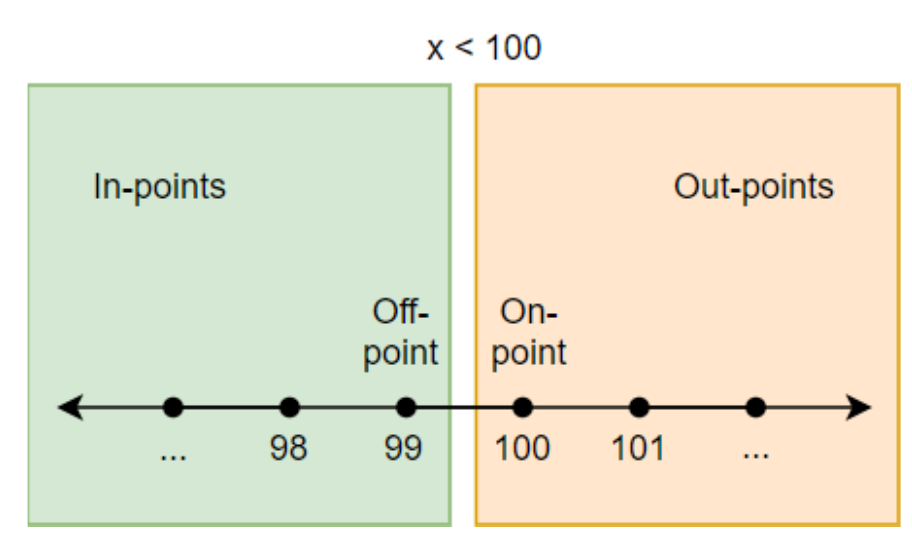
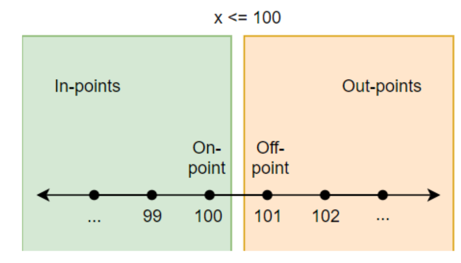
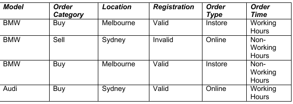
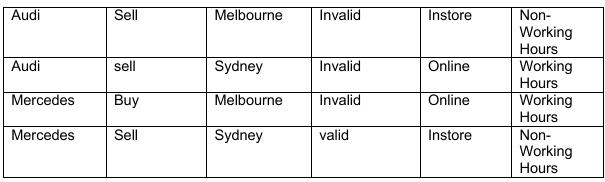

# Black box testing

## Boundary value testing

<!-- markdown-toc start - Don't edit this section. Run M-x markdown-toc-refresh-toc -->
**Table of Contents**

- [Black box testing](#black-box-testing)
    - [Boundary value testing](#boundary-value-testing)
        - [Identifying boundaries](#identifying-boundaries)
        - [Boundary 1:](#boundary-1)
            - [Example inputs](#example-inputs)
        - [Boundary 2:](#boundary-2)
            - [Example inputs](#example-inputs-1)
        - [Boundary definition](#boundary-definition)
    - [Implicitly boundaries](#implicitly-boundaries)
    - [Combinatorial Testing](#combinatorial-testing)
    - [Pairwise testing](#pairwise-testing)
        - [Example: car ordering application](#example-car-ordering-application)
    - [Jenny.c](#jennyc)

<!-- markdown-toc end -->

### What is black box testing?
A.k.a. **specification-based testing** or functional testing. Find circumstances in which the program does not behave according to it's specifications without knowing the internal behaviour and structure of the application

### Random testing
Random testing involves randomly - which is not the same as arbitrarily - selecting data using a random generator to test the program with.
Random testing either be very easy, or very hard, depending on the nature of the software under test. 
Random testing does not have bias and bugs are detected quickly.
However, its major drawback is that it is only capable of finding basic (low level) bugs. 

  * [ ] Step 1: The input domain is identified.
  * [ ] Step 2: Test inputs are selected independently from the domain.
  * [ ] Step 3: The system under test is executed on these inputs. The inputs constitute a random test set.
  * [ ] Step 4: The results are compared to the system specification. The test is a failure if any input leads to incorrect results; otherwise it is a success.

### Partitioning or classes
Mathematics and common sense converge to tell us that partition testing schemes are at their most effective when the partitions have **homogenous** failure behaviour. That is, either the system performs as expected on every input within the partition, or it **reveals a failure on every input within the partition**.


In some cases we have an **infinite number** of items in a partition. It is just impractical to test them all. That is why it is important to devise strategies using partitioning techniques.

### Equivalence testing
One input value from one specific partition will make the program **behave in the same way**. Therefore, any input we select should give us the same result.

This idea of **inputs being equivalent to each other** is what we call equivalence
partitioning.

#### Numerical ranges
Wherever you have a numerical range defined in the spec, there are likely to be equivalence classes. Numerical ranges can be used in other contexts too. When dealing with inputs that are lists of items, the length of that input may form a numerical range.

#### input categories ####
If you have got inputs that have a property that falls into a small set of clearly defined categories, they can fairly obviously form a set of equivalence classes. 

* Side lengths that form a scalene triangle.
* Side lengths that form an equilateral triangle.
* Side lengths that form an isosceles triangle.

#### Invalid inputs ####

Groups of invalid inputs are often just as valuable as groups of valid inputs in finding equivalence classes

* Side lengths where at least one side length is non-positive.
* Side lengths where the hypotenuse (longest side) is longer than the sum of the two shorter sides.

#### Looking at outputs to find inputs ####
For instance, consider a program to simulate a simple calculator, with a fixed-size output display buffer eight digits long. This might give you two equivalence classes for test operations:

* Operations with outputs that fit in an eight-digit display.
* Operations that don't.


## Category partition testing
**Multiple properties** on which you can define equivalence classes

Ostrand and Balcer states that test frames may have "zero or one choice" from each category. 

For instance, if you added another choice to the Transaction Type category, balance check, there is no "Transaction Amount" applicable. That's OK. You don't have to include an entry from a particular category if it's not applicable.

Test cases need to be clearly defined, and  non-overlapping.


### Exceptional cases
Exceptional cases are often cases not from specifications. Exceptional behaviour does not always have to be combined with all the different values of the other inputs.

E.g. negative price is often an exceptional case.

This can be added to the test suite but not necessarily tested.

### Identifying boundaries


```python
def total_points(current_points, remaining_lives):

    if current_points < 50:

        return current_points + 50
    elseif remaining_lives < 3: 
        return current_points + 30
    else:
        return current_points *3

```
* Score < 50
* Score >= 50 and remaining life < 3
* Score >= 50 and remaining life >= 3
 


### Boundary 1:

Score < 50

Off-point: 49
On-point: 50

#### Example inputs

B1.1 = input = {score=49, remaining lives=5}, output={99}
B1.2 = input = {score=50, remaining lives=5}, output={150}

### Boundary 2:

Score >=50, Remaining_lives < 3

Off-point (remaining life < 3): 2
On-point: 3

#### Example inputs
500 is arbitrarily chosen from an outpoint

B2.1 = input= {score=500, remaining lives=3}, output={1500}
B2.2 = input= {score=500, remaining lives=2}, output={530**

### Boundary definition
**On-point:** the value that is on the boundary
**Off-point**: the value closest to the boundary that flips the conditions. Note: when dealing with equalities or non-equalities (e.g. x = 6 or x ≠ 6, there are two off-points; one in each direction.
**In-points** are all the values that make the condition true.
**Out-points** are all the values that make the condition false.

 
 

## Implicitly boundaries

Explore the boundaries between your partitions

## Combinatorial Testing

Nearly all software failures are caused by interactions between relatively few parameters.

## Pairwise testing
**Pairwise testing** requires that for a given numbers of input parameters to the system each possible combination of values for any pair of parameters be covered by at least one test case

Category partitioning, discussed earlier, works well when intuitive constraints reduce the number of combinations to a small amount of test cases


### Example: car ordering application

a. Order Types
i. Buy
ii. Sell
b. Locations
i. Melbourne
ii. Sydney
c. Car Models
i. BMW
ii. Audi
iii. Mercedes
d. Registration Numbers
i. Valid (let us say ABC1500)
ii. Invalid
e. Order Types
i. E-Booking (I call it online for time being)
ii. In-Store
f. Order Times
i. Working hours (we can also call it trading hours)
ii. Non-working hours

 
 

## Jenny.c
```
jenny:
  Given a set of feature dimensions and withouts, produce tests
  covering all n-tuples of features where all features come from
  different dimensions.  For example (=, <, >, <=, >=, !=) is a
  dimension with 6 features.  The type of the left-hand argument is
  another dimension.  Dimensions are numbered 1..65535, in the order
  they are listed.  Features are implicitly named a..z, A..Z.
   3 Dimensions are given by the number of features in that dimension.
  -h prints out these instructions.
  -n specifies the n in n-tuple.  The default is 2 (meaning pairs).
  -w gives withouts.  -w1b4ab says that combining the second feature
     of the first dimension with the first or second feature of the
     fourth dimension is disallowed.
  -ofoo.txt reads old jenny testcases from file foo.txt and extends them.

  The output is a testcase per line, one feature per dimension per
  testcase, followed by the list of all allowed tuples that jenny could
  not reach.

  Example: jenny -n3 3 2 2 -w2b3b 5 3 -w1c3b4ace5ac 8 2 2 3 2
  This gives ten dimensions, asks that for any three dimensions all
  combinations of features (one feature per dimension) be covered,
  plus it asks that certain combinations of features
  (like (1c,3b,4c,5c)) not be covered.
```
