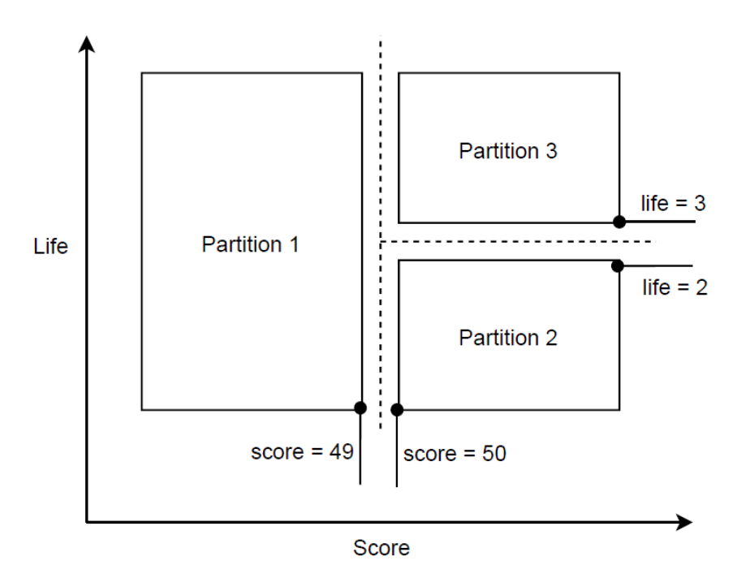

# Black box testing

## Boundary value testing

### Identifying boundaries

```python
def total_points(current_points, remaining_lives):

    if current_points < 50:

        return current_points + 50
    elseif remaining_lives < 3: 
        return current_points + 30
    else:
        return current_points *3

```

* Score < 50
* Score >= 50 and remaining life < 3
* Score >= 50 and remaining life >= 3

 

### Boundary 1:

Score < 50

Off-point: 49
On-point: 50

#### Example inputs

B1.1 = input = {score=49, remaining lives=5}, output={99}
B1.2 = input = {score=50, remaining lives=5}, output={150}

### Boundary 2:

Score >=50, Remaining_lives < 3

Off-point (remaining life < 3): 2
On-point: 3

#### Example inputs
500 is arbitrarily chosen from an outpoint

B2.1 = input= {score=500, remaining lives=3}, output={1500}
B2.2 = input= {score=500, remaining lives=2}, output={530}
