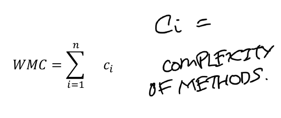
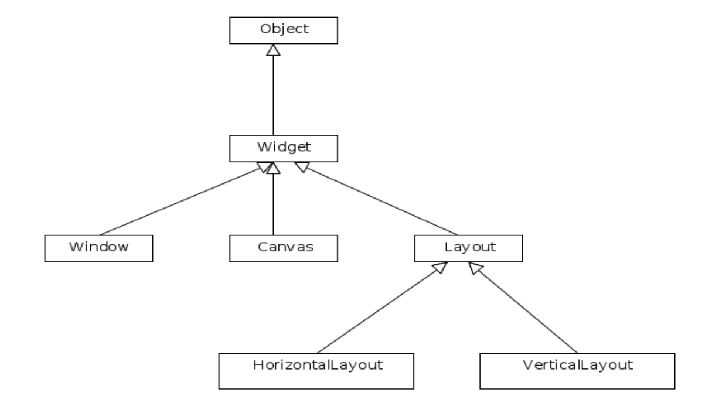
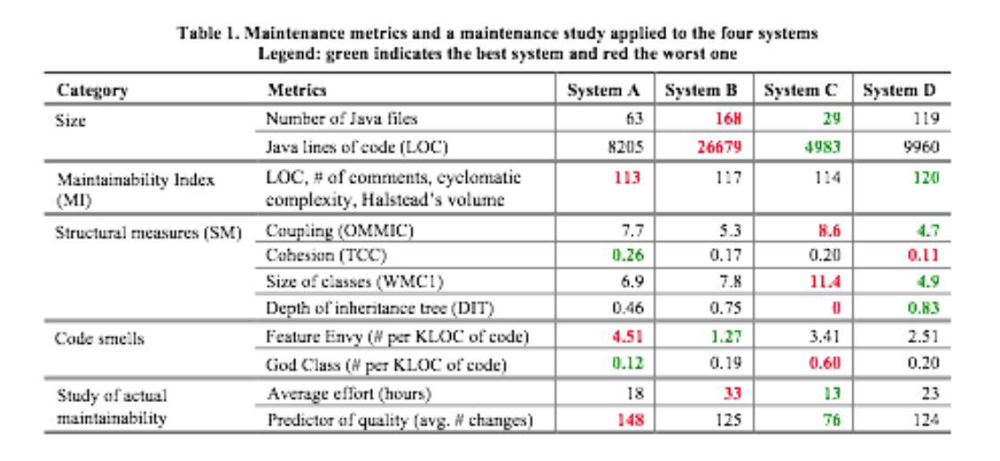

# Metrics

<!-- markdown-toc start - Don't edit this section. Run M-x markdown-toc-refresh-toc -->
**Table of Contents**

- [Metrics](#metrics)
    - [Testing metric](#testing-metric)
        - [Coverage metrics](#coverage-metrics)
    - [Mutation analysis](#mutation-analysis)
    - [Design and code metrics](#design-and-code-metrics)
        - [#Code size](#code-size)
            - [Comment lines](#comment-lines)
    - [Halsteads software science metrics](#halsteads-software-science-metrics)
    - [OO design metrics](#oo-design-metrics)
        - [Weighted methods per class (WMC)](#weighted-methods-per-class-wmc)
            - [Complexities for a method](#complexities-for-a-method)
    - [Depth of inheritance -DIT](#depth-of-inheritance--dit)
    - [Number of children - NOC](#number-of-children---noc)
    - [Coupling between objects - CBO](#coupling-between-objects---cbo)
    - [Response for a class - RFC](#response-for-a-class---rfc)
    - [Lack of cohesion in methods (LCOM)](#lack-of-cohesion-in-methods-lcom)
        - [If they share no instance variables](#if-they-share-no-instance-variables)
        - [LCOM](#lcom)

<!-- markdown-toc end -->

## Testing metric

### Coverage metrics

* Can compute statement and branch coverage

* MC/DC coverage are available for the kinds of languages in which safety-critical automotive and aerospace code is written

* Code coverage is easy to compute and useful indicator of test suit quality.

* There is *no reliable industry model* that can tell you "x% coverage is sufficient to give you reliability".

* **specification coverage** should somewhere around 100%

## Mutation analysis

* Involves automatically seeding a change in your code.
* Mutation score varies between 0 to 1.
* Better indication whether your test suite is any good than just code coverage.

* Can be problematic if **generating thousands of mutants and running the test suite on each of them**

## Design and code metrics

Statically analysing source code and in some cases uml diagrams

* Good indicator of **functional correctness** and potentially useful proxies for the maintainability and **portability of software**.

### #Code size

* Determine how big it is.

* lines of code (LOC). This very easy to measure

#### Comment lines
Are useful and often when there are a lot of comment lines it indicates that the code itself is harder to understand

Are quicker to write compared to code itself

**LOC counters** provide more detailed counts, tabulating comments and blank lines separately.

Larger methods are much more error-prone than small methods.

## Halsteads software science metrics

HSCM can predict the difficulty, effort required and likely correctness of code.

## OO design metrics

The more interactions and complex the interactions are between modules and classes, the harder code is to write and debug More interactions between classes means more mocking for unit testing, more tracing faults down through many different classes.

### Weighted methods per class (WMC)

For class with methods M_1, M_2 up to M_n.

Complexities of each method: c_1, c_2, c_n.

 

#### Complexities for a method

There are a number of ways  already discussed and Chdiamber and Kemerer deliberately did not refine this.

The complexity of a method is likely to be application specific due to different programming languages and different definitions of operands and operators.

The complexity metric **requires code to measure**. 

## Depth of inheritance -DIT

The depth or inheritance it takes to reach to the class of the inheritance tree.

DIT for <kbd>VerticalLayout</kbd> is 3 and DIT for object is 0.

A higher DIT number was thought to make designs more complex. This is because the class at the bottom of the hierarchy inherits more and more properties, but a higher DIT also implies more reuse (which is considered good.)

## Number of children - NOC

Widget has three children
Object has 1 children
Leaf nodes like VerticalLayout have zero children

High NOC indicates reuse (good) but also indicates inappropriate abstraction (bad). Classes with **high number of children were thought to require more testing, because high influence over large parts of the design is heavily used**.

## Coupling between objects - CBO

The number of other classes it interacts with directly. High coupling is bad because becoems harder to design, build, test debug, extend and reuse classes. CBO metric is reasonable measure f coupling and a high CBO number for classes is bad. More arrows between a class and other classes indicate high CBO

## Response for a class - RFC

All the methods in C and all the methods invoked directly by methods in C.

You do not need to worry about the methods invoked in the methods invoked by C (not transitive)

## Lack of cohesion in methods (LCOM)

The closeness of the relationships between the elements of the same module.

Cohesion, functional cohesion, occurs when a single clear and unambiguous purpose.

Methods: {M_1, M_2, M_n}
Instance variables a methods operates on: {I_j}

For **each pair** determine if any of the instance variables they operate on are the same. (That is, I_a and I-b contain at least one shared element)

Low cohesion as measured by this metric was believed by Chidamber and Kemerer tto lead to code that is less easy to **test, debug, maintain and resuse**,.

### If they share no instance variables

Add 1 to P, otherwise add 1 to Q.

### LCOM

    LCOM = P - Q, P > Q otherwise.

## Fault prediction

### Model generator
Academics tend to use machine learning techniques (Big data). This involves feed data into the model by "training it"

There are different types of fault prediction metrics:

* Static source code measures, like the ones we have been discussing
* Software process metrics such as the numbero f bugs already found in the modules.
* Personnel-based information such as who has been working on the modules.

> "...On the other hand, models using only static code metrics (typically complexity based) perform relatively poorly. Model performance does not seem to be improved by combining these metrics with OO metrics. Models seem to perform better using only OO metrics rather than only source code metrics. However, models using only LOC seem to perform just as well as those using only OO metrics and better than those models only using source code metrics."  

### Maintainability

Ability to maintain and extend the code we write.

Furthermore, they found this relationship was a useful rule of thumb for individual modules, not just whole systems made up of many modules:

> The figure shows that 364 files, or roughly 50 percent of the system, fall below the quality-cutoff index, strongly suggesting that this system is difficult to modify and maintain. Prior to our analysis, the HP maintenance engineers had stated that the system was very difficult to maintain and modify. Further analysis proved of - 91. Table 3. A polynomial comparison of two systems corroborated an informal evaluation by engineers. A that change-prone and defect-prone subsystem components (files) could be targeted using the ranked order of the maintainability indices.   

* Do developer's perceptions of maintainability relate to **actual quantifiable maintenance**
* properties - in a business context, does it relate to time/cost to maintain? 

* Does **a metric originally devised based on C code decades ago still apply to code written in OO languages such as Java, Python and so on**?

## The only metric that seems like a useful predictor of maintenance effort is... lines of code!

 
