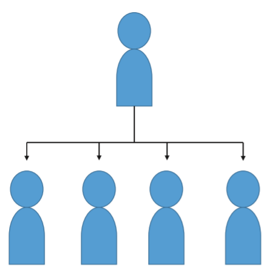

# Teams and Team-work

## Teams
### Teams vs group
* A group is a collection of people
* A team is a group that is (or is expected to be)
  * cohesive
  * focused on a common purpose or goal
* All teams are groups, but not all groups are teams!

### Why teams inside software?
* Important life skill
    * almost all non-trivial **research** and **software development** are done in a team.
    * important inter-personal skill in potential employers of IT graduates. 
    
* You’ll need it for later study: senior projects in IT disciplines often
involve teamwork

### When is teamwork required?
• Software engineering is about delivering systems that are large or
complicated or mission-critical (or all of these things!)
• To make these systems work, we will need
– lots of people
– working together effectively
• And these teams need to be structured carefully, because the
structure of the organization can affect the success of the project

### Conway's Law
> Organizations which design systems [...] are constrained to produce designs which are copies of the communication structures of these organizations.  
> -- **Melvin Conway, How do committees invent? 1967**

* To create a software module, developers need to communicate and collaborate
closely
* It’s harder to collaborate outside your team, and easier to collaborate with
teammates

> “If you have four groups working on a compiler, you’ll get a four-pass compiler.”  
> -- Eric S. Raymond

* So the software’s internal architecture ends up mirroring the organization’s
structure
  * which might not lead to the best architectural design…
  * if there’s a reorganization of team structure, the existing architecture might become hard to
  work with

## Why team work can be terrible?

### Autocracy

* Sometimes students think this is
what teams should be like
* The boss hands out orders, team
members carry them out
* This is a bad team structure!
  * little opportunity for teammates to collaborate
  * morale tends to suffer
  * boss is a single point of failure 
  * if they get sick or are transferred, team cannot function

## Tuckman model
